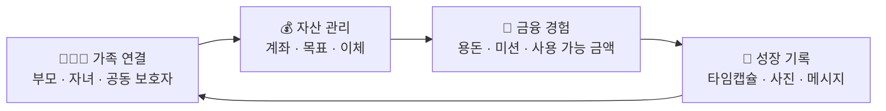
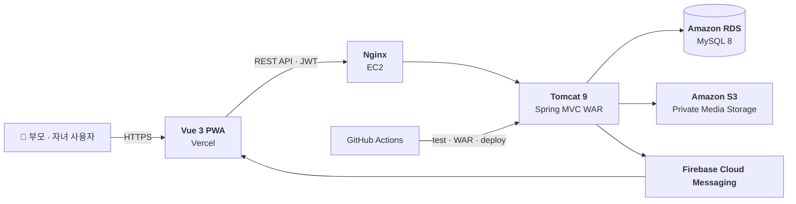
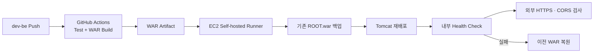

<div align="center">

# Azas

### _"아이의 오늘을 기록하고, 함께 미래를 준비하다."_

부모와 자녀가 함께 만드는 **가족 금융·성장 기록 서비스**

[](https://azas-seven.vercel.app)
[](#-기술-스택)
[](#-기술-스택)
[](#-기술-스택)

</div>

---

## 🎯 이런 문제를 풀고 있습니다

아이의 성장에 맞춰 준비할 금융 정보는 많지만, 부모의 자산 관리와 아이의 금융 경험, 그리고 그 과정의 추억은 서로 분리되어 있습니다.

> 아이를 위한 저축은 계속되지만, **왜 모으고 어떤 순간을 함께했는지**는 쉽게 남지 않습니다.
> Azas는 가족의 자산 흐름을 관리하면서, 저축의 과정도 성장 기록으로 남깁니다.

Azas는 부모와 자녀가 각자의 역할로 참여해 자산을 함께 관리하고, 용돈·미션·목표 저축·타임캡슐을 하나의 경험으로 연결합니다.



---

## 이대주 · 프론트 팀장 기여

팀 전체 기능과 별도로 프론트 3명의 기능 담당 배정과 일정 결정 및 화면 구현 방향을 맡았습니다. 전체 팀장은 별도로 있었으며 백엔드의 이체 정합성·보안·배포 구현을 개인 기여로 주장하지 않습니다.

| 상황 | 직접 판단하고 수행한 작업 |
| --- | --- |
| 프론트 진행 관리 | 화이트보드에 진행 단계를 표시하고 팀원들의 구두 설명으로 현재 상태 확인 |
| 기능 범위 조정 | 초반 제외했던 아이 페이지·미션·체크리스트·용돈 요청이 서비스 목표에 필요하다고 판단해 발표 2주 미만 시점에 다시 추가 |
| 역할 변경 | 발표 2주 전 전체 팀장 이탈 후 맡고 있던 일부 업무를 새 팀장과 나누고 일정 재조정 |
| 마감 관리 | 기능별 마감일과 프론트 전체 마감일 설정 및 발표 3일 전 개발 완료를 목표로 개발에 집중 |
| 경험 설계 | 타임캡슐의 폴라로이드 콘셉트와 성장 이벤트를 금융 흐름에 연결하는 화면 방향 구성 |

이 기록은 참여자의 프로젝트 회고 기준입니다. 서비스 범위와 개발 일정을 조정한 경험이며 사용자 증가나 금융 성과를 측정한 결과는 아닙니다.

### 기획 관점의 회고

기능을 줄일 때 구현량뿐 아니라 서비스 목표가 유지되는지를 함께 판단해야 한다는 점을 배웠습니다. 다시 기획한다면 신생아부터 초등학교 고학년 자녀를 둔 부모로 타깃을 좁히고 성장 단계에 따라 목표 저축과 기록을 이어가는 흐름을 검증하고자 합니다. 이는 후속 개선 방향입니다.

---

## ✨ 핵심 기능

| 기능                         | 설명                                                                                                     |
| ---------------------------- | -------------------------------------------------------------------------------------------------------- |
| **🔐 소셜 로그인·가족 연결** | Google·Kakao 로그인 후 부모·자녀 역할을 구분하고, 초대 링크로 공동 보호자와 자녀 계정을 연결합니다.      |
| **👨‍👩‍👧 자녀별 자산 관리**      | 부모-자녀 관계 권한을 기준으로 자녀의 계좌, 자산 현황, 금융 목표를 관리합니다.                           |
| **💸 안전한 내부 이체**      | 멱등키, DB UNIQUE 제약, 행 잠금, 조건부 출금, Transaction으로 중복·동시 요청에도 잔액 정합성을 지킵니다. |
| **🎯 금융 목표·적금 관리**   | 자녀의 적금 계좌를 목표와 연결하고, 목표 금액·저축 현황·달성률을 확인합니다.                             |
| **🪙 용돈·미션 경험**        | 자녀가 용돈을 요청하고 미션을 수행하며, 부모 승인 흐름을 통해 금융 경험을 쌓습니다.                      |
| **📮 금융 타임캡슐**         | 적금 납입 거래에 사진과 메시지를 기록하고, 공개일 이후 가족의 성장 기록으로 다시 확인합니다.             |
| **🔔 알림**                  | DB 알림을 기준으로 활성 화면에서는 커서 Polling을 사용하고, FCM Web Push 기반도 함께 구성했습니다.       |
| **📊 자산 리포트**           | 자녀의 월별 자산·저축·목표 현황을 Snapshot으로 저장해 추이를 보여줍니다.                                 |

> 현재 금융 계좌·이체는 실제 금융기관 연동이 아닌 **내부 Mock 금융 데이터**를 기준으로 동작합니다.

---

## 🏗 시스템 아키텍처



## 🛠 기술 스택

### Frontend


### Backend


### Data · Infra · Tools


### 구성 상세

| 영역             | 실제 적용 기술                                                                | 사용 목적                                                                                                                  |
| ---------------- | ----------------------------------------------------------------------------- | -------------------------------------------------------------------------------------------------------------------------- |
| Frontend         | Vue 3, TypeScript, Vite, Vue Router, Axios                                    | SPA 화면 구성, 타입 기반 개발, 라우팅, API 통신                                                                            |
| UI · 웹앱        | Tailwind CSS 4, Pretendard, Lucide, `vite-plugin-pwa`                         | 반응형 UI, 아이콘, 설치 가능한 PWA와 오프라인 캐시                                                                         |
| 상태 · 생성 도구 | Pinia, OpenAPI Generator                                                      | Pinia는 프로젝트에 등록되어 있으나 현재 도메인 상태 사용은 제한적이며, OpenAPI Generator는 API 타입·클라이언트 생성에 사용 |
| Backend          | Java 17, Spring MVC 5.3, Spring JDBC/Tx, WAR, Gradle                          | 계층형 API 서버와 외부 Tomcat 배포 구성                                                                                    |
| 데이터 접근      | MyBatis, HikariCP, MySQL Connector/J                                          | 명시적 SQL·트랜잭션 제어, 커넥션 풀, MySQL 연동                                                                            |
| 인증 · 보안      | JJWT, Spring Security 의존성, AES-256-GCM, SHA-256                            | JWT 검증은 커스텀 Resolver로 수행하며, 민감 정보 암호화·토큰/초대 코드 해시 처리                                           |
| API · 외부 연동  | Springfox Swagger, AWS SDK v2(S3), Firebase Admin SDK, Firebase Web Messaging | API 문서화, Presigned URL 미디어 업로드, 푸시 알림 기반 마련                                                               |
| 테스트 · 품질    | JUnit 5, Mockito, Spring Test, Vitest, k6, ESLint, Oxlint, Prettier           | 단위·통합·프론트 테스트, 부하 점검, 정적 분석과 포맷 관리                                                                  |
| 배포 · 운영      | Vercel, AWS EC2, Nginx, Tomcat 9, Amazon RDS, Amazon S3, GitHub Actions       | 프론트/백엔드 분리 배포, HTTPS 리버스 프록시, 데이터·미디어 저장, CI/CD                                                    |

> Firebase 푸시는 Firebase 프로필과 운영 자격 증명이 설정된 환경에서 활성화됩니다. 자동이체 실행, 실제 은행 연동, 다중 서버 이중화는 현재 구현 범위가 아닌 후속 고도화 항목입니다.

---

## 🧩 프로젝트 구조

```text
Azas/
├── frontend/                 # Vue 3 + TypeScript PWA
│   ├── src/
│   │   ├── api/              # OpenAPI 생성 Client 및 HTTP 설정
│   │   ├── components/       # 공통 UI 컴포넌트
│   │   ├── composables/      # 재사용 로직
│   │   ├── services/         # Polling·Push 등 서비스 로직
│   │   └── views/            # 화면 단위 페이지
│   └── scripts/              # OpenAPI Client 생성 스크립트
│
├── backend/                  # Spring MVC WAR 애플리케이션
│   └── src/main/
│       ├── java/com/azas/
│       │   ├── domain/       # auth·family·finance·notification 등 도메인
│       │   └── global/       # 보안·예외·응답·Health Check
│       ├── resources/
│       │   ├── mapper/       # MyBatis XML Mapper
│       │   ├── db/           # Schema·Seed·Migration SQL
│       │   └── spring/       # Spring MVC·DB XML 설정
│       └── webapp/           # web.xml
│
└── .github/workflows/        # Backend CI/CD
```

---

## 🚀 배포 파이프라인



- 기존 WAR를 백업한 뒤 새 WAR를 배포합니다.
- Tomcat 기동 또는 내부 Health Check가 실패하면 이전 WAR를 자동 복원합니다.
- 외부 HTTPS 및 CORS 검사는 배포 후 GitHub Actions에서 확인합니다.
- 현재 배포는 Tomcat stop/start 방식으로, 무중단 배포는 아닙니다.

---

## 🧪 품질 관리

| 영역            | 검증 대상                                         |
| --------------- | ------------------------------------------------- |
| Unit Test       | 금액 계산, 상태 전이, Token·암복호화 규칙         |
| Service Test    | 권한, 이체 Transaction, 중복 요청, 실패 Rollback  |
| Mapper Test     | MyBatis SQL, 컬럼 매핑, 동적 조건                 |
| Controller Test | 요청 검증, HTTP 상태 코드, 표준 오류 응답         |
| Frontend Test   | HTTP Token 처리, Push 기기 등록, Polling 수명주기 |
| Load Test       | k6 기반 알림 Polling 주기와 응답 지표 비교        |

---

## 👥 팀원

| 역할            | GitHub                                           |
| --------------- | ------------------------------------------------ |
| Backend Leader  | [@junsoo0719](https://github.com/junsoo0719)     |
| Backend         | [@umhye1](https://github.com/umhye1)             |
| Frontend Leader | [@j00112459](https://github.com/j00112459)       |
| Frontend        | [@cxfls](https://github.com/cxfls)               |
| Frontend        | [@hyeonjin6530](https://github.com/hyeonjin6530) |

---

## 📚 문서

| 문서                                                                 | 설명                                           |
| -------------------------------------------------------------------- | ---------------------------------------------- |
| [프로젝트 컨텍스트](docs/PROJECT_CONTEXT.md)                         | 도메인 모델, 구현 원칙, API 방향               |
| [기술 발표 Q&A 가이드](docs/TECH_PRESENTATION_QA_GUIDE.md)           | 기술 선택·정합성·보안·배포 관련 발표 준비 자료 |
| [발표 설계·학습 가이드](docs/PRESENTATION_DESIGN_AND_STUDY_GUIDE.md) | 서비스 소개, 기술 스택, 아키텍처, 발표용 문구  |
| [로컬 DB 설정](docs/backend-local-database.md)                       | Backend DB 환경변수와 로컬 실행 참고           |
| [FCM 설정](docs/backend-firebase-push.md)                            | Firebase Cloud Messaging 설정 참고             |

---

<div align="center">

**[🌐 Azas 바로가기](https://azas-seven.vercel.app)**

<sub>Made with 🌱 by Azas</sub>

</div>
