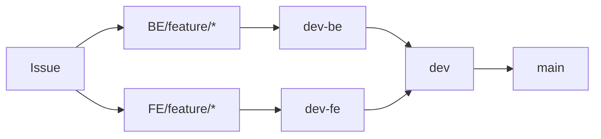

# 아자스(Azas) Git · GitHub 협업 컨벤션

> 적용 대상: `Azas` 단일 저장소  
> 마지막 정리: 2026-08-04

## 1. 기본 원칙

- 모든 기능 작업은 **Issue 생성 → 파트별 feature 브랜치 생성 → 파트 통합 브랜치 PR → `dev` 통합 PR → `main` 릴리스 PR** 순서로 진행한다.
- `main`, `dev`, `dev-fe`, `dev-be` 브랜치에는 직접 push하지 않는다.
- 브랜치는 **개인 이니셜이 아닌 기능 단위**로 만든다. 그래야 나중에 기능별 작업 이력을 찾기 쉽다.
- 프론트엔드와 백엔드는 하나의 저장소를 함께 사용하되, 각 팀은 자신의 통합 브랜치와 담당 폴더를 중심으로 작업한다.

```text
Azas/
├─ frontend/    # Vue · Capacitor 앱
├─ backend/     # Spring MVC 서버
├─ docs/        # ERD, API 명세, 회의 문서 등
└─ .github/     # Issue/PR 템플릿, Actions
```

## 2. 브랜치 전략



| 브랜치 | 역할 | 생성 기준 | 병합 대상 |
|---|---|---|---|
| `main` | 배포·발표 가능한 안정 버전 | 직접 작업 금지 | `dev → main` PR |
| `dev` | FE·BE를 합치는 팀 통합 브랜치 | 직접 작업 금지 | `dev-fe → dev`, `dev-be → dev` PR |
| `dev-fe` | 프론트엔드 통합 브랜치 | `dev`에서 분기, 직접 작업 금지 | `FE/feature/* → dev-fe` PR |
| `dev-be` | 백엔드 통합 브랜치 | `dev`에서 분기, 직접 작업 금지 | `BE/feature/* → dev-be` PR |
| `FE/feature/*` | 프론트엔드 개별 기능 개발 | Issue 또는 기능 단위 | `dev-fe` |
| `BE/feature/*` | 백엔드 개별 기능 개발 | Issue 또는 기능 단위 | `dev-be` |
| `FE/BE/fix/*` | 일반 버그 수정 | 버그 Issue 또는 수정 단위 | 해당 파트 통합 브랜치 |
| `hotfix/*` | 배포 후 즉시 수정이 필요한 버그 | 예외 상황에만 사용 | `main`, 이후 `dev` 동기화 |

### 브랜치 이름 규칙

```text
FE/feature/이슈번호-기능-이름
BE/feature/이슈번호-기능-이름
FE/fix/이슈번호-수정-내용
BE/fix/이슈번호-수정-내용
hotfix/이슈번호-수정-내용
```

예시:

```text
FE/feature/12-child-registration
BE/feature/18-time-capsule-create
BE/feature/25-product-api
FE/fix/31-login-token-expiry
```

- 이슈가 아직 없으면 번호 없이 작성할 수 있지만, 작업 시작 전 Issue 연결을 권장한다.
- 하나의 브랜치에는 가능한 한 **하나의 기능 또는 하나의 목적**만 담는다.
- 다른 사람의 feature 브랜치에 직접 push하지 않는다.
- `dev-fe`, `dev-be`는 오래 유지되는 팀 통합 브랜치이며 feature 브랜치를 병합한 뒤 삭제하지 않는다.

## 3. 작업 흐름

### 개별 기능 개발

1. GitHub Project에서 할 일을 확인하거나 Issue를 생성한다.
2. 담당 파트의 최신 통합 브랜치를 기준으로 기능 브랜치를 만든다.

   ```bash
   # 백엔드 예시
   git switch dev-be
   git pull origin dev-be
   git switch -c BE/feature/18-time-capsule-create

   # 프론트엔드 예시
   git switch dev-fe
   git pull origin dev-fe
   git switch -c FE/feature/18-time-capsule-create
   ```

3. 작업 후 작은 단위로 커밋하고 원격 feature 브랜치에 push한다.

   ```bash
   git push -u origin BE/feature/18-time-capsule-create
   ```

4. PR의 대상 브랜치를 정확히 지정한다.

   ```text
   BE/feature/* 또는 BE/fix/* → dev-be
   FE/feature/* 또는 FE/fix/* → dev-fe
   ```

5. 담당 파트의 승인 1명을 받고, 충돌·테스트 실패가 없는지 확인한 뒤 병합한다.
6. 병합된 feature 브랜치는 GitHub에서 삭제한다.

### 파트 통합과 릴리스

- 백엔드와 프론트엔드는 작업이 쌓이면 각각 `dev-be → dev`, `dev-fe → dev` PR을 만든다.
- `dev` 통합 PR은 팀 통합 담당자의 확인 후 병합한다.
- 배포·발표 전에는 `dev → main` PR을 만들고 전체 동작을 확인한 뒤 병합한다.
- `dev`에 반영된 최신 변경을 파트 통합 브랜치에 다시 반영해야 하면, 직접 push 대신 PR로 동기화한다.

## 4. Pull Request 규칙

### PR 생성 기준

- PR은 **기능 하나가 동작 가능한 단위**로 올린다.
- 화면만 먼저 올려도 되지만, 아직 서버 연동 전이라면 PR 본문에 명확히 적는다.
- 관련 Issue가 있으면 PR 본문에 `Closes #12` 형식으로 연결한다. 기능 PR이 파트 통합 브랜치에 병합되면 해당 Issue는 닫힌다.
- 큰 기능은 너무 오래 한 PR에 쌓지 말고, 화면/UI · API · 연동처럼 의미 있는 단위로 나눈다.

### PR 제목 형식

```text
[FE] 자녀 등록 화면 구현
[BE] 자녀 등록 API 구현
[FE/BE] 자녀 등록 API 연동
[Docs] API 명세 수정
```

### PR 본문 템플릿

```md
## 관련 Issue
Closes #이슈번호

## 작업 내용
- 

## 확인 사항
- [ ] 로컬 실행 확인
- [ ] 콘솔 에러 없음
- [ ] API/화면 동작 확인

## 리뷰어 참고 사항
- 
```

### 병합 방식과 승인

- `BE/feature/* → dev-be` PR은 **backend 코드오너를 포함한 승인 1명 이상**이 필요하다.
- `FE/feature/* → dev-fe` PR은 **frontend 코드오너를 포함한 승인 1명 이상**이 필요하다.
- `dev-be → dev`, `dev-fe → dev` PR은 변경된 `backend/` 또는 `frontend/` 폴더의 코드오너 팀 승인 1명 이상과 통합 동작 확인 후 병합한다.
- `dev → main` PR은 발표·배포 전 통합 PR이며, 승인 1명 이상과 전체 동작 확인 후 병합한다.
- 병합 방식은 기본적으로 **Squash and merge**를 사용한다. 여러 중간 커밋을 하나의 기능 단위 이력으로 정리하기 위함이다.
- 병합 후에는 원격 feature 브랜치를 삭제한다.

### GitHub Ruleset 설정 기준

| 대상 브랜치 | 필수 설정 |
|---|---|
| `dev-fe` | PR 병합만 허용, 직접 push 금지, frontend 코드오너 승인, Required approvals `1` |
| `dev-be` | PR 병합만 허용, 직접 push 금지, backend 코드오너 승인, Required approvals `1` |
| `dev` | PR 병합만 허용, 직접 push 금지, 변경 경로별 frontend/backend 팀 승인, 코드오너 승인, Required approvals `1` |
| `main` | PR 병합만 허용, 직접 push 금지, Required approvals `1` |
| 공통 | force push 및 브랜치 삭제 금지, 새 push 시 기존 승인 무효화, 리뷰 대화 해결 필수 |

> Ruleset만으로 PR의 출발 브랜치까지 제한할 수는 없으므로, GitHub Actions 상태 검사로 아래 병합 경로를 검증한다.
>
> ```text
> BE/feature/* 또는 BE/fix/* → dev-be
> FE/feature/* 또는 FE/fix/* → dev-fe
> dev-be 또는 dev-fe → dev
> dev → main
> ```

## 5. 커밋 메시지 규칙

형식:

```text
type: 작업 내용
```

주요 타입:

| 타입 | 사용 시점 | 예시 |
|---|---|---|
| `feat` | 새로운 기능 추가 | `feat: 자녀 등록 API 추가` |
| `fix` | 버그 수정 | `fix: 목표 금액 검증 오류 수정` |
| `docs` | 문서 수정 | `docs: 타임캡슐 API 명세 갱신` |
| `refactor` | 기능 변화 없는 구조 개선 | `refactor: 목표 조회 서비스 분리` |
| `style` | 코드 포맷·공백·UI 스타일 조정 | `style: 홈 카드 여백 조정` |
| `test` | 테스트 코드 추가·수정 | `test: 자녀 등록 서비스 테스트 추가` |
| `chore` | 설정·의존성·빌드 등 기타 작업 | `chore: axios 의존성 추가` |

- 제목은 한글로 간결하게 작성한다.
- `update`, `수정`, `작업중`처럼 내용이 불명확한 메시지는 피한다.
- 서로 관련 없는 변경을 한 커밋에 섞지 않는다.

## 6. Issue · GitHub Project 관리

### Issue 작성 원칙

- 기능 개발, 버그, 문서 작업은 가능한 Issue로 남긴다.
- Issue 제목은 결과가 드러나게 작성한다.

```text
[FE] 자녀 등록 화면 구현
[BE] 자녀 등록 API 구현
[Bug] 타임캡슐 열람일 계산 오류
[Docs] 타임캡슐 API 명세 보완
```

- Issue에는 담당자(Assignee), 파트 라벨, 우선순위, 완료 조건을 적는다.
- 한 Issue의 범위가 너무 크면 하위 작업 Issue로 나눈다.

### Project 보드 사용

경로: `KB-Final-PJT-27-4 조직 → Projects`

| 상태 | 의미 |
|---|---|
| `Todo` | 할 일은 정해졌지만 아직 시작하지 않음 |
| `In Progress` | 담당자가 feature 브랜치에서 작업 중 |
| `In Review` | feature PR이 `dev-fe` 또는 `dev-be` 병합을 기다리는 중 |
| `Done` | feature PR이 담당 파트 통합 브랜치에 병합되고 기능 확인이 끝남 |

권장 라벨:

```text
frontend / backend / common / docs / bug
priority: high / priority: medium / priority: low
```

## 7. 역할 간 협업 규칙

- **프론트엔드**: API 호출 전에 요청·응답 형식과 상태값을 API 명세에서 확인한다.
- **백엔드**: API 경로, 요청값, 응답값, 에러 형식이 바뀌면 API 명세와 관련 Issue/PR에 함께 반영한다.
- DB 스키마, 공통 타입, API 계약을 바꾸는 경우에는 먼저 팀 채널에 공유한다.
- 공용 문서 변경은 `docs:` 커밋 또는 별도 PR로 남긴다.
- 코드 세부 스타일은 이 문서가 아니라 별도의 **코드 컨벤션**을 따른다.

## 8. 금지 사항

- `main`, `dev`, `dev-fe`, `dev-be`에 직접 push
- 다른 사람 브랜치에 허가 없이 push
- 빌드 에러·실행 불가 상태를 설명 없이 병합
- `.env`, API 키, DB 비밀번호, 개인 토큰 커밋
- 충돌 해결 중 다른 사람 코드를 이해 없이 삭제
- 의미 없는 대규모 포맷 변경을 기능 PR에 섞기

## 9. 빠른 체크리스트

PR 생성 전 아래를 확인한다.

- [ ] 최신 `dev-fe` 또는 `dev-be` 기준으로 작업했는가?
- [ ] 브랜치가 기능 단위이고 올바른 파트 접두어를 사용하는가?
- [ ] PR의 대상 브랜치가 `dev-fe` 또는 `dev-be`로 올바른가?
- [ ] 커밋 메시지가 작업 내용을 설명하는가?
- [ ] 로컬에서 화면/API가 동작하는가?
- [ ] 관련 Issue와 PR을 연결했는가?
- [ ] API 또는 DB 변경 사항을 문서와 팀원에게 공유했는가?
